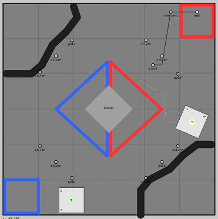

# A Simple Robot Simulator
This is a Processing sketch that implements a simple 2D physics-based simulation of the drive
aspect of one or more robots on a rectangular field. It is designed for concept explanation,
and prototyping and testing of autonomous code by FTC (and potentially FRC) teams.
It may also be useful for new driver practice and for developing game strategy.

This code is in the public domain; all code is free to be used for any purpose without
attribution, with the usual disclaimers. Code license is here: https://github.com/GreenJellyBeans/FTC12598/blob/master/LICENSE.

## Overview
The program supports both autonomous and driver controlled robots. Both modes are controlled by
robot code somewhat similar to the FIRST Java programming model in FTC and FRC, in that there
are `init` and `loop` methods that can query (limited) sensor information and set the power of 
four drive motors. The physics calculations assume a mecanum drive, though the code structure
does not preclude other kinds of drives being introduced in the future. Multiple gamepads are
supported, that can be dynamically mapped to robots using special joystick button combinations
(including the START+A command familiar to
FTC drivers). A screenshot of the program is shown below.



Here are some more features:
- Physics simulation, while simple, is "pure" in the sense that only forces are directly
calculated. The robot's position and velocity are never set directly except in the very
beginning, but instead follow from acceleration produced by forces, including friction and collision
forces. The physical model of the robot is very simple: a square rigid object with a fixed
mass and rotational inertia. It is "powered" by diagonal forces acting on its four corners - the
simulation of mecanum wheels. Various simplifying assumptions are made when calculating the net
force and torque on the robot - most of this code is implemented in classes  `MecanumDrive` 
and `CollisionPhysics`.
- The field is configurable - it's makeup is defined in the files `data/field_base.txt` and
  `data/field_extras.txt`. Thanks to the Green Jellybeans (the FTC team that I mentor) for
  creating these field elements that represent the 2018-19 FTC Rover Ruckus competition.
- Colored tape on the field can be picked up by sensors on the robot. The sensors read a "blurry"
  version of the field, representing the average over a certain field of view (this is the constant
  `BLUR_RADIUS` in class `RawSensorModule`). This is to develop and test autonomous code that
  reads the tape markings.
- One supported field element is a `block` - it is a rectangular immovable object. The lander
 in the center of the field is implemented as a block. Robots cannot penetrate blocks (well,
 there is a glitch in the simulation that allows penetration under certain circumstances...).
 The main purpose of this (as well as simulation of collisions with walls) is to be able to
 develop code that relies on bumping into or backing into flat surfaces to properly align the robot.
- Simulated encoder readings are available. This feature is not tried out and it has some
limitations - in particular it simulates "normal" wheels, not mecanum wheels, though it is
likely that it can be used as long as the robot is moving forward, not strafing. Encoder values
can be read using method `DriveBase.readEncoder`.
- Random perturbations make the robot behave slightly, well, randomly. This is to better
simulate real-world conditions. See the comments next to constants `RobotProperties.PERTUBRATION_*`
and methods `MecanumDrive.perturb*` for details. This is a newly-introduced feature and will
be extended to add randomness to encoder readings, color sensor readings, and position "sensor"
readings.


Here is a snippet from the sample drive code, taken from file `SampleDriveTask.pde`:

```
void loop() {
    GamepadInterface gp = robot.gamepad1;
    if (!gamepadEnabled && gp.a()) {
      gamepadEnabled = true;
    }

    if (!gamepadEnabled) {
      return; // ***** EARLY RETURN ******
    }
    // If "Y" button is pressed, we clear the encoder values on all motors.
    if (gp.y()) {
      robot.base.resetEncoders();
    }

    if (gp.right_bumper()) {         //right bumper makes the robot spin clockwise
      robot.base.setMotorPowerAll(0.5, -0.5, 0.5, -0.5); // FL FR BL BR
    } else if (gp.left_bumper()) {    //left bumper makes the robot spin counterclockwise
      robot.base.setMotorPowerAll(-0.5, 0.5, -0.5, 0.5);
    } else {
      double fwd  = gp.right_stick_y();
      double turn  = gp.left_stick_x();
      double strafe = gp.right_stick_x();
      setHybridPower(fwd, turn, strafe);
    }
  }

// Sets the power to each of the 4 motors of the mecanum drive given
  // the incoming request to go forward, turn and strafe by amounts
  // ranging within [-1, 1]
  void setHybridPower(double fwd, double turn, double strafe) {
    // Let's clip anyways, incase we get faulty input
    fwd = clipInput(fwd);
    turn = 0.5*clipInput(turn);
    strafe = clipInput(strafe);

    Field f = robot.field;
    f.addExtendedStatus(String.format("HPOWER  fwd:%5.2f  turn:%5.2f  strafe:%5.2f", fwd, turn, strafe));

    // Note: +ve strafe makes the robot go right, and with
    // the robot's front facing increasing x, to go right
    // means to go in the direction of decreasing y:
    //
    //                 ^ y-axis
    //      robot      |
    //    ...... FL    |
    //    .    .       --> x-axis
    //    ...... FR
    //
    double pFL = fwd - strafe + turn;
    double pFR = fwd + strafe - turn;
    double pBL = fwd + strafe + turn;
    double pBR = fwd - strafe - turn;

    // m is the max absolute value of the individual motor power amounts. If it is too small, we stop all motors.
    double m = Math.max(Math.max(Math.abs(pFL), Math.abs(pFR)), Math.max(Math.abs(pBL), Math.abs(pBR)));
    if (m<0.1) {
      robot.base.setMotorPowerAll(0, 0, 0, 0);
    } else {
      // Scale everything so no magnitude exeeds 1
      double scale = Math.min(1/m, 1);
      pFL *= scale;
      pFR *= scale;
      pBL *= scale;
      pBR *= scale;
      robot.base.setMotorPowerAll(pFL, pFR, pBL, pBR);
    }
  }
```

The NOTES.md file is an informal design and implementation log that charts the
development course of this project. The TODO.md file contains a list of open issues.

## About Processing
This program uses the standard Processing environment - v3 or later.
Processing is a wonderful interactive programming environment that lets one write
programs in Java (and some other languages) with minimal overhead. It has,a simple IDE, and a vibrant
community that has created many useful libraries. While it is possible to package a Processing
sketch into a stand-alone program, this robot simulator is designed to remain as a list of Java
classes, any aspect of which can be easily modified.

If you have never used Processing before, it will be worth it to take a detour and learn a bit
more about it -- see www.processing.org. Processing was the basis for the Arduino IDE, so Arduino
programmers will be on somewhat familiar turf.

_Note to Java programmers new to Processing_: All the tabs that make up a Processing Sketch are
concatenated and enclosed in a single, hidden, top-level class. This top-level class extends
built-in Processing class `processing.core.PApplet`.
Thus all the classes you see in the robot simulator are actually
inner classes of the top-level class, and have access to all its methods and instance variables
without any qualification. Thus, if you see a call to method `draw(...)`, this is a call
to the containing classes' method. This can be confusing the first time you come across it, but
it makes for less cluttered code. For more details, visit https://www.processing.org/reference/environment/#Sketchbook.

## Installing Processing and Required Libraries

The Processing IDE can be downloaded from www.processing.org. It is a stand-alone installation,
just unzip it and move it into a folder and run the Processing application from that folder.
No other RTEs or SDKs are required to rune Processing - it has it's own complete Java implementation
and does not use any Java implementation you may have on your machine.

Processing supports its own set of optional libraries that may be loaded into its environment. The
robot simulator requires the following libraries: "Game Control Plus" - for gamepad integration,
and "G4P" for configuring new game controllers. 
(Currently the only Gamepad controller supported by the robot simulator is the
Logitec Gamepad F310 - though it seems easy to add other controllers using the Game
Control Plus library and supporting UX. See http://lagers.org.uk/gamecontrol/)


To load these libraries into Processing, Select the `Tools > Add Tool` menu,
then select the Libraries tab, scroll down until you see "G4P" and "Game Control Plus", select those
and press the `Install` button.


## Running the Robot Simulator and Binding Gampads

To run the robot simulator, just click on simple_robot_simuator.pde and then click on the play icon.
To bind one or more gamepads, edit the `data/config.txt` file - set `numGamepads` to the number
of Logitec F310 gamepads connected (unfortunately the program does not yet dynamically detect
the number of attached compatible gamepads). To bind a gamepad to robot "1" as role "A", press
the DPad `Up` key while pressing the `A` button. To bind a gamepad to robot "2" as role "A", press
the DPad `Left` key while pressing the `A` button. More details are provided in
design note "September 29, 2018-A" titled "Thoughts on Multiple Gamepad mapping to multiple robots"
in file `NOTES.md`.

## Defining Multiple Robots With Their Own Drive Task Code
Examine the code in `simple_robot_simulator.pde`. This is the "top-level" code that,
as mentioned previously, is implicitly enclosed in a containing class. The
`setup` method sets up the global array of robots, `g_robots` and defines another global
array of drive tasks, `g_driveTasks`, that are mapped one-to-one to robots. Here's a code
snippet:

```
  // Create two robots, with their own unique names, colors and initial position and orientation
  g_robots = new Robot[]{
    newRobot(ROBOT_1, color(0, 255, 0), g_field.BREADTH/2-0.5, g_field.DEPTH/2-0.5, radians(180)),
    newRobot(ROBOT_2, color(255, 255, 0), g_field.BREADTH/2+.5, g_field.DEPTH/2+.5, radians(180)) 
  }; 

  // Setup each robot's drive task
  g_driveTasks = new DriveTask[]{
    new SampleDriveTask(g_robots[0]), 
    new SampleDriveTask(g_robots[1]),
  };

```

A drive task is a class that implements the `DriveTask` interface. It controls the actions of a 
particular robot. The sample drive task, `SampleDriveTask` is an example of a drive task that 
implements "driver controlled" (AKA "teleop") logic. 
As the Green Jellybeans develop their autonomous code, we would expect more drive task classes to be 
added to this repository.


